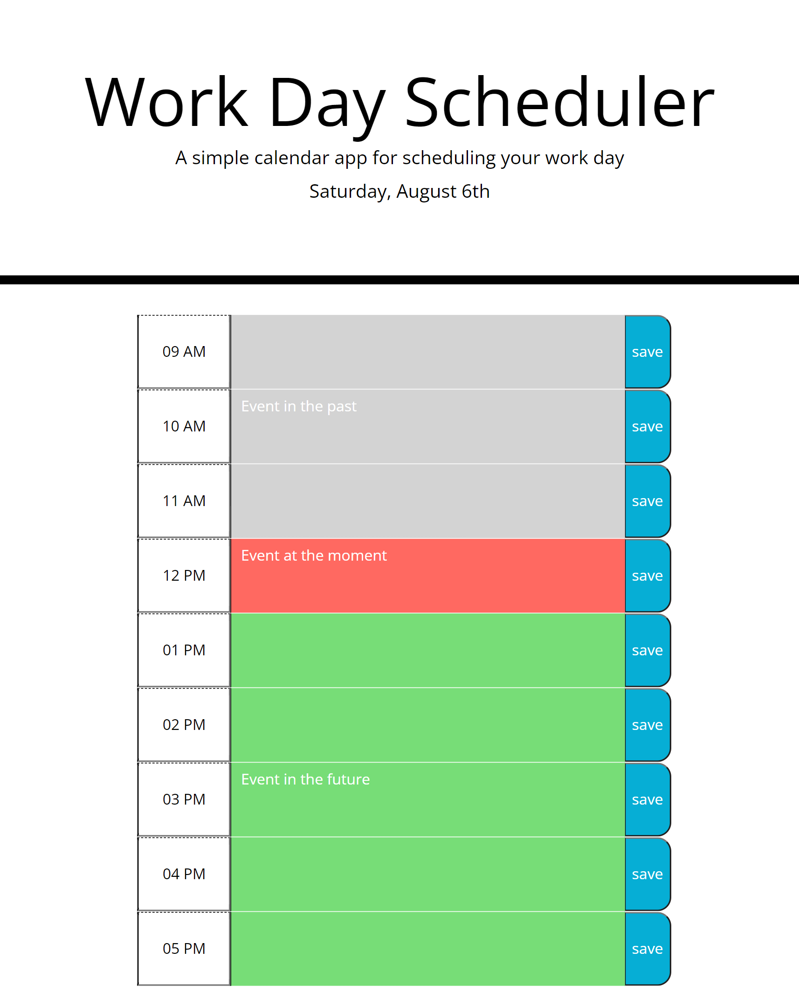

# Work Day Scheduler

## Aout the Project

A simple calendar application that allows a user to save events for each hour of the day.

## Features

```md
      User is able to see and schedule different asks in different standard business hours, which will be indicated as past (grey color), present (red color), or future (green color).
      User is able to enter and save an event. The date will be saved in local storage and will be always traced back.
      
      jQuery library was used when work with data. 
      [Moment.js](https://momentjs.com/) library was used to work with date and time.
```

## Deployment

Please follow [https://odthientho.github.io/w5c-work-day-scheduler](https://odthientho.github.io/w5c-work-day-scheduler/) to the deployed Code Quiz site.


## Screenshots

